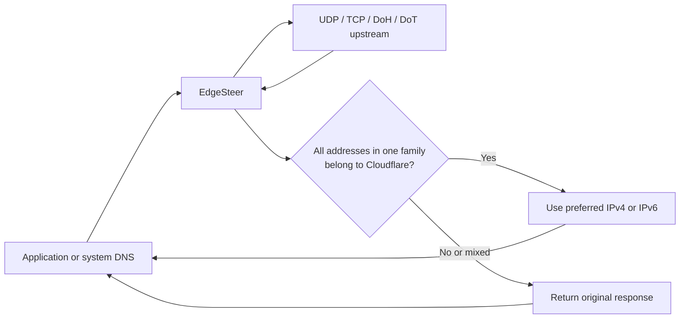

# EdgeSteer

[](https://github.com/Fuxx-1/EdgeSteer/actions/workflows/ci.yml)
[](LICENSE)

EdgeSteer is a local Rust DNS steering proxy for preferred Cloudflare edge IPs. It forwards ordinary DNS queries to configurable UDP, TCP, DoH, or DoT upstreams; detects Cloudflare from the returned addresses rather than the domain name; and rewrites verified Cloudflare answers to the current preferred IP for that address family.

It is not a recursive resolver, VPN, generic CDN proxy, or bandwidth benchmark. Its built-in optimizer chooses reachable addresses using HTTPS availability and end-to-end latency.

## Why It Works

Many sites use Cloudflare without a `cloudflare` or `cf` string in their domain. EdgeSteer never guesses ownership from a name or CNAME. It checks whether the actual A/AAAA addresses, or HTTPS/SVCB IP hints, belong to Cloudflare's published ranges.



This keeps non-Cloudflare and mixed responses unchanged. When a response is rewritten, EdgeSteer removes DNSSEC authentication state (`AD`, `DO`, and RRSIG records) so it never presents modified data as authenticated.

## Features

- One Rust binary for macOS, Linux, and Windows.
- UDP, TCP, DoH, and DoT upstreams in ordered failover order.
- DoH uses a fixed bootstrap IP with HTTPS Host/SNI/certificate verification intact.
- DoT requires an explicit `server_name` for SNI and certificate verification.
- Cloudflare range refresh from the official IPv4 and IPv6 lists, with an embedded fallback list.
- Separate IPv4 and IPv6 preferred addresses.
- Rewrites A, AAAA, HTTPS, and SVCB IP hints only when the corresponding address family is fully verified as Cloudflare.
- Integrated latency and HTTPS availability probe, with no Go binary, CSV, or shell-script dependency.
- Atomic config reload: upstreams, preferred IPs, range refresh, and optimizer settings update after saving the TOML file.

## Install

Prebuilt release archives are produced for:

| Platform | Artifact |
| --- | --- |
| Linux x86_64 | `EdgeSteer-x86_64-unknown-linux-musl.tar.gz` |
| macOS Intel | `EdgeSteer-x86_64-apple-darwin.tar.gz` |
| macOS Apple Silicon | `EdgeSteer-aarch64-apple-darwin.tar.gz` |
| Windows x86_64 | `EdgeSteer-x86_64-pc-windows-msvc.zip` |

Until the first tagged release is published, build from source with Rust 1.85 or newer:

```sh
git clone https://github.com/Fuxx-1/EdgeSteer.git
cd EdgeSteer
cp config.example.toml edgesteer.toml
cargo build --release
./target/release/edgesteer --config edgesteer.toml --check-config
```

On Windows PowerShell:

```powershell
Copy-Item config.example.toml edgesteer.toml
cargo build --release
.\target\release\edgesteer.exe --config edgesteer.toml --check-config
```

## First Run

Do not change system DNS first. Set `listener.address` in `edgesteer.toml` to `127.0.0.1:53535`, then start the proxy and query it directly.

macOS and Linux:

```sh
RUST_LOG=info ./target/release/edgesteer --config edgesteer.toml
dig @127.0.0.1 -p 53535 www.cloudflare.com A +short
```

Windows PowerShell:

```powershell
$env:RUST_LOG = "info"
.\target\release\edgesteer.exe --config edgesteer.toml
Resolve-DnsName www.cloudflare.com -Server 127.0.0.1 -Type A
```

The sample configuration uses a fixed preferred test address only when you explicitly set `[preferred]`. Otherwise the enabled optimizer selects an address after its first successful probe round.

## Upstreams

`[[upstreams]]` is an ordered failover list. EdgeSteer uses the first upstream that completes the connection and returns a valid DNS response. It only tries the next entry after a transport, TLS, HTTP, or DNS-message failure.

```toml
# Traditional DNS
[[upstreams]]
protocol = "udp" # "tcp" is also supported
address = "223.5.5.5:53"
timeout_ms = 2000

# DNS over TLS: use a numeric endpoint and the certificate/SNI name.
[[upstreams]]
protocol = "dot"
address = "1.1.1.1:853"
server_name = "cloudflare-dns.com"
timeout_ms = 3000

# DNS over HTTPS: address is a fixed bootstrap IP for the URL host.
# Its port must equal the URL port. URL hostname remains the Host, SNI,
# and certificate name, so the connection is still authenticated.
[[upstreams]]
protocol = "doh"
address = "1.1.1.1:443"
url = "https://cloudflare-dns.com/dns-query"
timeout_ms = 3000
```

DoH only accepts `https` endpoints and sends standard `application/dns-message` POST requests. DoT and DoH have no option to disable certificate verification. The numeric bootstrap endpoint prevents a resolution loop after the operating system starts using EdgeSteer as its DNS server.

Saving the TOML file triggers a debounced reload in roughly 250 ms. Future queries use the new upstream list; in-flight queries continue with the snapshot they started with. Invalid changes are rejected and the prior configuration remains active. Changing `listener.address` or `allow_remote` still requires a restart because sockets cannot be rebound atomically.

## Preferred IPs

The `[preferred]` section sets a manual initial or fixed address:

```toml
[preferred]
ipv4 = "104.16.99.1"
# ipv6 = "2606:4700:0000:0000:0000:0000:0000:1111"
```

Set `optimizer.enabled = false` for a fixed address. When the optimizer is enabled, a successful probe replaces the corresponding address family and retains the last good result if a later probe fails. Add IPv6 candidates only when the host has a working IPv6 path.

The optimizer measures TCP connection, TLS handshake, and an HTTPS request to `www.cloudflare.com`; it does not claim to be a full download-throughput benchmark. Keep candidate ranges narrow and verify with real application traffic when bandwidth is the deciding factor.

## Use As System DNS

Use port 53 in `edgesteer.toml` only after the high-port test passes. The default loopback listener is intentional. Do not expose `allow_remote = true` to the public internet: EdgeSteer is not a hardened public recursive DNS service.

### macOS

Run the binary with permission to bind port 53, then point the desired network service at loopback:

```sh
sudo ./target/release/edgesteer --config "$(pwd)/edgesteer.toml"
networksetup -listallnetworkservices
sudo networksetup -setdnsservers "Wi-Fi" 127.0.0.1
```

Restore DHCP-provided DNS:

```sh
sudo networksetup -setdnsservers "Wi-Fi" Empty
```

### Linux

Install the binary and config, grant only the capability required for port 53, then configure the active network manager or `systemd-resolved` to use `127.0.0.1`:

```sh
sudo install -Dm755 target/release/edgesteer /usr/local/bin/edgesteer
sudo install -Dm600 edgesteer.toml /etc/edgesteer/edgesteer.toml
sudo setcap cap_net_bind_service=+ep /usr/local/bin/edgesteer
/usr/local/bin/edgesteer --config /etc/edgesteer/edgesteer.toml
```

For a `systemd-resolved` host, inspect the active link with `resolvectl status` and set that link's DNS to `127.0.0.1`. NetworkManager and other resolvers may manage the same setting differently.

### Windows

Run an elevated PowerShell when port 53 is unavailable to a normal process, then set the active adapter DNS after EdgeSteer is listening:

```powershell
.\edgesteer.exe --config C:\EdgeSteer\edgesteer.toml
Set-DnsClientServerAddress -InterfaceAlias "Wi-Fi" -ServerAddresses 127.0.0.1
```

Restore automatic DNS:

```powershell
Set-DnsClientServerAddress -InterfaceAlias "Wi-Fi" -ResetServerAddresses
```

Browser- or application-level secure DNS (DoH/DoT) can bypass system DNS. Configure those clients to use the system resolver when EdgeSteer is expected to process their queries.

## Development

```sh
cargo fmt --all -- --check
cargo clippy --all-targets -- -D warnings
cargo test --all-targets
cargo build --release
```

GitHub Actions runs formatting, Clippy, tests, and release builds on Linux, macOS, and Windows. A valid Semantic Version tag triggers a GitHub Release with the four archives above:

- `v1.2.3` creates a normal release.
- `v1.2.3-alpha.1`, `v1.2.3-beta.1`, or `v1.2.3-rc.1` creates a pre-release.

For example:

```sh
git tag -a v0.1.0 -m "EdgeSteer v0.1.0"
git push origin v0.1.0
```

Tags that do not follow this format fail before the platform builds begin, preventing accidental releases.

## License

MIT. See [LICENSE](LICENSE).

Cloudflare is a trademark of Cloudflare, Inc. EdgeSteer is an independent project and is not affiliated with or endorsed by Cloudflare.
