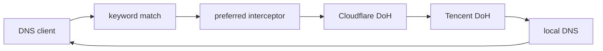

# EdgeSteer

[](https://github.com/Fuxx-1/EdgeSteer/actions/workflows/ci.yml)
[](LICENSE)

中文 | [English](docs/en/README.md)

EdgeSteer 是一个跨 macOS、Linux 和 Windows 的本地 Rust DNS steering proxy。它通过 JSON 配置多级 upstream 回退，并用内置拦截器把已确认属于 Cloudflare 的地址改写为当前优选 IP。

EdgeSteer 判断的是 DNS 响应里的地址，而不是域名文字。一个站点即使域名和 CNAME 都不含 `cf` 或 `cloudflare`，只要返回的 A、AAAA、HTTPS 或 SVCB 地址属于 Cloudflare 官方网段，就可以进入优选流程；混合返回或无法确认时保持原响应。

## 工作方式

默认示例链路如下：



`preferred` 是响应拦截器，不是独立 resolver。它先让后继 upstream 返回完整 DNS 响应，再在地址全部通过 Cloudflare 网段校验时改写 A、AAAA 以及 HTTPS/SVCB hints。改写会清除 DNSSEC 的 `AD`、`DO` 和 RRSIG，避免把已修改的数据标成已认证。

内置 optimizer 以 TCP + TLS + HTTP 探测 Cloudflare 地址，要求测试端点返回 2xx 且 `server: cloudflare`，并独立选择最快的 IPv4 与 IPv6。它是连通性和时延选择器，不等同于真实业务带宽测试。

## 快速开始

需要 Rust 1.85 或更新版本。发布包覆盖 Linux x86_64、macOS Intel、macOS Apple Silicon 和 Windows x86_64。

```sh
git clone https://github.com/Fuxx-1/EdgeSteer.git
cd EdgeSteer
cp config.example.json edgesteer.json
cargo build --locked --release
./target/release/edgesteer --config edgesteer.json --check-config
RUST_LOG=info ./target/release/edgesteer --config edgesteer.json
```

Windows PowerShell：

```powershell
Copy-Item config.example.json edgesteer.json
cargo build --locked --release
.\target\release\edgesteer.exe --config edgesteer.json --check-config
$env:RUST_LOG = "info"
.\target\release\edgesteer.exe --config edgesteer.json
```

首次运行建议使用高端口，不要立即改系统 DNS：

```json
{
  "listener": { "address": "127.0.0.1:53535", "allow_remote": false }
}
```

验证：

```sh
dig @127.0.0.1 -p 53535 www.cloudflare.com A +short
```

完整字段、DoH/DoT 约束、关键词和插件示例见[配置文档](docs/zh/configuration.md)。

## 文档导航

| 主题 | 中文 | English |
| --- | --- | --- |
| 项目介绍与快速开始 | 本页 | [README](docs/en/README.md) |
| 架构与请求生命周期 | [architecture.md](docs/zh/architecture.md) | [architecture.md](docs/en/architecture.md) |
| JSON 配置、匹配与插件 | [configuration.md](docs/zh/configuration.md) | [configuration.md](docs/en/configuration.md) |
| 安装、运行、热重载与排障 | [operations.md](docs/zh/operations.md) | [operations.md](docs/en/operations.md) |
| 开发、测试、CI 与发布 | [development.md](docs/zh/development.md) | [development.md](docs/en/development.md) |

## 重要边界

- 配置文件是严格 JSON，未知字段会被拒绝；`entry`、layer、fallback 和 plugin 引用必须存在，fallback 不能成环。
- `local` 必须填写明确的数值 resolver 地址，例如路由器或 SmartDNS，不能隐式调用系统 resolver，否则系统 DNS 指向 EdgeSteer 后会形成回环。
- 只有网络、TLS、HTTP、空响应、畸形 DNS 或响应关联校验失败才进入 fallback。有效的 NXDOMAIN、NODATA、SERVFAIL 和 REFUSED 会直接返回。
- plugin 只允许静态编译进程序的 builtin 实现，JSON 不会加载动态库、脚本或外部命令。
- 默认只监听回环地址。`allow_remote: true` 会把它变成局域网 DNS 服务，应由使用者自行承担访问控制和滥用风险。

## 许可证

MIT，见 [LICENSE](LICENSE)。EdgeSteer 与 Cloudflare 无隶属或背书关系。
