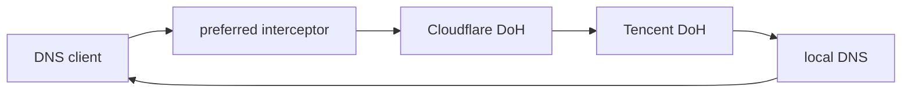

# EdgeSteer

[](https://github.com/Fuxx-1/EdgeSteer/actions/workflows/ci.yml)
[](LICENSE)

EdgeSteer is a local Rust DNS steering proxy for preferred Cloudflare edge IPs. It uses a JSON-defined, multi-layer fallback graph and built-in response interceptor plugins. It runs on macOS, Linux, and Windows.

It identifies Cloudflare from returned IP addresses, not from domain spelling. A domain can be hosted behind Cloudflare even if neither its name nor its CNAME contains `cf` or `cloudflare`; EdgeSteer checks the returned A, AAAA, HTTPS, and SVCB address data against Cloudflare's published networks.

## How it works

The sample configuration is the following chain:



`preferred` is a response interceptor, not a DNS resolver. It forwards the request to its fallback, then rewrites an answer only when every address in the relevant family is verified as Cloudflare. Mixed and non-Cloudflare answers are returned unchanged. A rewrite removes DNSSEC authentication state (`AD`, `DO`, and RRSIG records), so modified data is never represented as authenticated.

The built-in optimizer probes Cloudflare addresses over HTTPS and keeps the best reachable IPv4 and IPv6 address independently. It is not a bandwidth benchmark; verify real traffic when throughput matters.

## Install

Release archives are produced for Linux x86_64, macOS Intel, macOS Apple Silicon, and Windows x86_64. Until a tagged release exists, build from source with Rust 1.85 or newer:

```sh
git clone https://github.com/Fuxx-1/EdgeSteer.git
cd EdgeSteer
cp config.example.json edgesteer.json
cargo build --release
./target/release/edgesteer --config edgesteer.json --check-config
```

On Windows PowerShell:

```powershell
Copy-Item config.example.json edgesteer.json
cargo build --release
.\target\release\edgesteer.exe --config edgesteer.json --check-config
```

## First run

Use a high local port before changing system DNS:

```json
{
  "listener": { "address": "127.0.0.1:53535", "allow_remote": false }
}
```

Merge that change into `edgesteer.json`, then run:

```sh
RUST_LOG=info ./target/release/edgesteer --config edgesteer.json
dig @127.0.0.1 -p 53535 www.cloudflare.com A +short
```

On Windows:

```powershell
$env:RUST_LOG = "info"
.\target\release\edgesteer.exe --config edgesteer.json
Resolve-DnsName www.cloudflare.com -Server 127.0.0.1 -Type A
```

## Configuration

Copy [`config.example.json`](config.example.json) and adapt it. Its meaningful structure is:

```json
{
  "request_timeout_ms": 8000,
  "entry": "preferred",
  "plugins": [
    {
      "tag": "cloudflare-preferred",
      "type": "cloudflare_preferred",
      "rewrite_ttl_secs": 60,
      "preferred": { "ipv4": "104.16.99.1" },
      "optimizer": { "enabled": false }
    }
  ],
  "layers": [
    {
      "tag": "preferred",
      "type": "interceptor",
      "plugin": "cloudflare-preferred",
      "fallback": "cloudflare-doh"
    },
    {
      "tag": "cloudflare-doh",
      "type": "doh",
      "address": "1.1.1.1:443",
      "url": "https://cloudflare-dns.com/dns-query",
      "fallback": "tencent-doh"
    },
    {
      "tag": "tencent-doh",
      "type": "doh",
      "address": "120.53.53.53:443",
      "url": "https://doh.pub/dns-query",
      "fallback": "local"
    },
    {
      "tag": "local",
      "type": "udp",
      "address": "192.168.1.1:53"
    }
  ]
}
```

`local` must be a numeric, explicit resolver address, such as a router, SmartDNS instance, or traditional resolver. It never means “ask the operating system resolver”: after system DNS points to EdgeSteer, doing so would form a loop. EdgeSteer rejects a layer that overlaps its listener address.

### Layers and fallback

Each layer has a unique `tag`, a `type`, and an optional `fallback`. The request starts at `entry`; a transport/TLS/HTTP/invalid-DNS failure continues at the configured fallback. A valid DNS response, including NXDOMAIN, NODATA, SERVFAIL, or REFUSED, is returned immediately to avoid querying more providers and changing answers.

Supported network layer types are:

| Type | Required fields | Notes |
| --- | --- | --- |
| `udp` | `address` | Traditional DNS over UDP. A truncated response is retried over TCP to the same endpoint before fallback. |
| `tcp` | `address` | Traditional DNS over TCP. |
| `doh` | `address`, `url` | `address` is a numeric bootstrap endpoint; URL host remains the TLS SNI, HTTP Host, and certificate name. |
| `dot` | `address`, `server_name` | DNS over TLS with mandatory SNI/certificate verification. |
| `interceptor` | `plugin`, `fallback` | Runs the built-in plugin on the successful fallback response. |

Every upstream DNS response is decoded and checked for a matching transaction ID, QR flag, opcode, and question before it is accepted. DoH accepts only HTTPS, disables inherited proxy environment settings, follows no redirects, and requires `application/dns-message`.

### Direct keyword matching

Any layer can declare a `match` block. For a one-question DNS request, EdgeSteer selects the first matching layer in `layers` declaration order and begins there; it then follows that layer's own fallback only. For example, this sends `.cn` names straight to Tencent DoH and does not query Cloudflare DoH first:

```json
{
  "tag": "tencent-doh",
  "type": "doh",
  "address": "120.53.53.53:443",
  "url": "https://doh.pub/dns-query",
  "fallback": "local",
  "match": {
    "mode": "label",
    "keywords": ["cn"]
  }
}
```

`label` is the default and matches a complete, case-insensitive DNS label; `local` matches `printer.local` but not `notlocal.example`. Use `"mode": "contains"` only when an explicit literal substring rule is intended. Multiple-question requests always use `entry` so one DNS packet is not sent to different providers.

A direct rule starts at its target layer. Therefore, matching a resolver bypasses interceptors earlier in the chain. Put the rule on `preferred` when that response must still be optimized, or arrange the graph so the interceptor is on the selected path.

### Preferred plugin

`cloudflare_preferred` is a statically built-in plugin; JSON cannot load a dynamic library or command. It supports optional static startup values:

```json
{
  "tag": "cloudflare-preferred",
  "type": "cloudflare_preferred",
  "preferred": {
    "ipv4": "104.16.99.1",
    "ipv6": "2606:4700::1111"
  },
  "optimizer": { "enabled": false }
}
```

Static values are checked against the current Cloudflare network list. When the optimizer is enabled, a successful probe replaces the corresponding family and a failed probe retains the last good value.

## Hot reload

Saving a valid JSON file reloads it after a short debounce. Future requests use a single new runtime snapshot; in-flight requests retain their old snapshot. Invalid JSON, unknown tags, cycles, malformed upstreams, and invalid static preferred IPs are rejected while the last valid configuration remains active.

Changing `listener.address` or `allow_remote` is recorded but needs a process restart because the listening sockets cannot be rebound atomically.

## Use as system DNS

Only use port 53 after direct high-port tests pass. The default loopback listener is intentional; `allow_remote: true` should not be exposed publicly because EdgeSteer is not a hardened public recursive resolver.

The listener limits itself to 128 in-flight DNS queries. Under a sudden UDP burst it drops excess requests so normal DNS client retries cannot exhaust process file descriptors.

On macOS, point the desired network service at loopback after EdgeSteer is listening:

```sh
sudo networksetup -setdnsservers "Wi-Fi" 127.0.0.1
```

Restore DHCP DNS with:

```sh
sudo networksetup -setdnsservers "Wi-Fi" Empty
```

On Linux and Windows, configure the active network manager or adapter to use `127.0.0.1` after the process is running. Browser or application Secure DNS can bypass the system resolver; configure those clients to use the system resolver when EdgeSteer should process their queries.

## Development and releases

```sh
cargo fmt --all -- --check
cargo clippy --all-targets -- -D warnings
cargo test --locked --all-targets
cargo build --locked --release
```

GitHub Actions runs formatting, Clippy, tests, and native builds on Linux, macOS, and Windows. Pushing a semantic tag creates a GitHub Release:

- `v1.2.3` creates a normal release.
- `v1.2.3-alpha.1`, `v1.2.3-beta.1`, or `v1.2.3-rc.1` creates a pre-release.

```sh
git tag -a v0.1.0 -m "EdgeSteer v0.1.0"
git push origin v0.1.0
```

## License

MIT. See [LICENSE](LICENSE).

Cloudflare is a trademark of Cloudflare, Inc. EdgeSteer is independent and not affiliated with or endorsed by Cloudflare.
