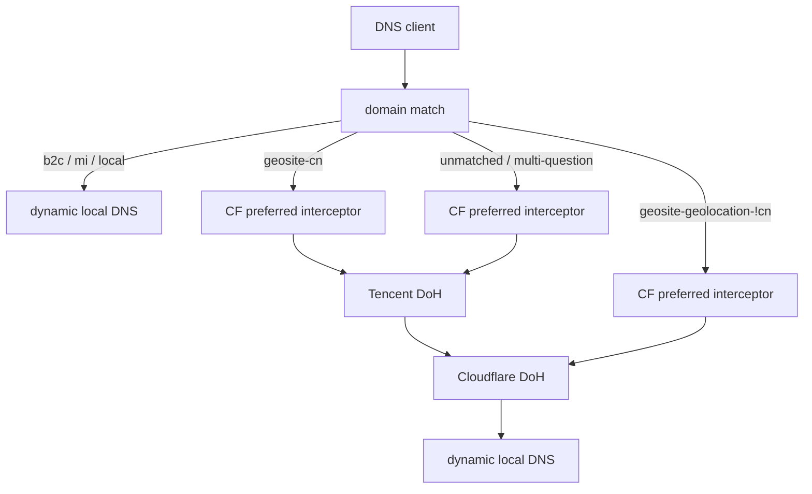

# EdgeSteer

[](https://github.com/Fuxx-1/EdgeSteer/actions/workflows/ci.yml)
[](LICENSE)

中文 | [English](docs/en/README.md)

EdgeSteer 是一个跨 macOS、Linux 和 Windows 的本地 Rust DNS steering proxy。它通过 JSON 配置多级 upstream 回退，并用内置拦截器把已确认属于 Cloudflare 的地址改写为当前优选 IP。

EdgeSteer 判断的是 DNS 响应里的地址，而不是域名文字。一个站点即使域名和 CNAME 都不含 `cf` 或 `cloudflare`，只要返回的 A、AAAA、HTTPS 或 SVCB 地址属于 Cloudflare 官方网段，就可以进入优选流程；混合返回或无法确认时保持原响应。

## 工作方式

默认示例按关键词和 `sing-geosite` 规则集分流：



配置中的实际选择顺序是：

- `b2c`、`mi`、`local` 关键词 → 动态本地 DNS；
- `geosite-cn` → 优选拦截 → Tencent DoH → Cloudflare DoH → 动态本地 DNS；
- `geosite-geolocation-!cn` → 优选拦截 → Cloudflare DoH → 动态本地 DNS；
- 未被规则集收录的域名（及多 question 请求）→ 优选拦截 → Tencent DoH → Cloudflare DoH → 动态本地 DNS。

`geosite-geolocation-!cn` 不是“所有非中国域名”的补集，只覆盖该规则集已收录的海外域名；因此未知域名仍保留默认的完整回退链。三个带优选的分支都从 interceptor 开始：它先让后继 upstream 返回完整 DNS 响应，再在地址全部通过 Cloudflare 网段校验时改写 A、AAAA 以及 HTTPS/SVCB hints。改写会清除 DNSSEC 的 `AD`、`DO` 和 RRSIG，避免把已修改的数据标成已认证。

内置 optimizer 以 TCP + TLS + HTTP 探测 Cloudflare 地址，要求测试端点返回 2xx 且 `server: cloudflare`，并独立选择最快的 IPv4 与 IPv6。它是连通性和时延选择器，不等同于真实业务带宽测试。

## 快速开始

需要 Rust 1.85 或更新版本。发布包覆盖 Linux、macOS 和 Windows 的 x86_64 与 ARM64；macOS 发布的是对应架构的 `.dmg` App 磁盘镜像。

```sh
git clone https://github.com/Fuxx-1/EdgeSteer.git
cd EdgeSteer
cp config.example.json "$HOME/edgesteer.json"
cargo build --locked --release
./target/release/edgesteer --check-config
RUST_LOG=info ./target/release/edgesteer
```

Windows PowerShell：

```powershell
Copy-Item config.example.json "$env:USERPROFILE\edgesteer.json"
cargo build --locked --release
.\target\release\edgesteer.exe --check-config
$env:RUST_LOG = "info"
.\target\release\edgesteer.exe
```

## Iced 原生界面

macOS 推荐下载 Release 中对应架构的 `EdgeSteer-*-apple-darwin.dmg`，将 `EdgeSteer.app` 拖到“应用程序”。DNS 引擎由 App bundle 管理；监听 53 端口时，App 会按需启动同一 bundle 内的隐藏授权 helper，不会安装独立的 `edgesteer` 命令行程序或常驻 LaunchDaemon。若机器上有旧版 root 服务，可在设置页点击“移除旧版命令行服务”并授权清理。

`edgesteer-ui` 使用 [Iced](https://github.com/iced-rs/iced) 构建，但它只是可随时退出的配置界面。启动时，轻量的 EdgeSteer Agent 负责菜单栏、DNS 引擎、系统 DNS 与登录启动；设置窗口通过本机受限控制通道向 Agent 发出命令。保存前会调用同一套严格校验，并提供 listener、resolver layer/fallback、SRS 规则集、Cloudflare 优选插件和 optimizer 的表单配置。

```sh
cargo build --locked --release --features gui
./target/release/edgesteer-ui
```

服务与界面固定使用 `~/edgesteer.json`（Windows 为 `%USERPROFILE%\edgesteer.json`）。界面默认使用中文暗色模式，macOS 使用 `PingFang SC` 渲染中文；语言和黑/白主题位于设置页的下拉框。菜单栏是启动、停止、系统 DNS、登录启动和退出的主入口，设置窗口用于编辑配置与查看详细状态。macOS App 是菜单栏代理，不显示 Dock 图标；从菜单栏可重新打开设置窗口。macOS 上可启用“登录时打开”，它注册的是当前 App 的用户级 LaunchAgent；启用系统 DNS 时才请求管理员授权。

系统 DNS 只会接管原本使用 DHCP 自动 DNS 的物理服务，并保存一份“由 EdgeSteer 接管”的服务清单，不保存或回放旧 DNS 地址。默认关闭设置窗口会结束 Iced 图形进程并释放 GPU/Metal 资源，Agent 和 DNS 引擎继续在菜单栏运行；从菜单栏明确选择“退出 EdgeSteer”后，Agent 才会先恢复这份清单到自动 DNS，再停止引擎并关闭设置窗口。恢复失败时 App 保持运行，避免留下无法解析的 `127.0.0.1`。手工显式 DNS 不会被覆盖。Linux、Windows 可以构建并使用界面配置 DNS 服务，系统 DNS 注册仍由各自网络管理器处理；Linux 菜单栏需要 GTK 3 与 Ayatana AppIndicator 运行时。

首次运行建议使用高端口，不要立即改系统 DNS：

```json
{
  "listener": { "address": "127.0.0.1:53535", "allow_remote": false }
}
```

验证：

```sh
dig @127.0.0.1 -p 53535 www.cloudflare.com A +short
```

完整字段、DoH/DoT 约束、关键词、sing-box SRS 域名规则集和插件示例见[配置文档](docs/zh/configuration.md)。

## 文档导航

| 主题 | 中文 | English |
| --- | --- | --- |
| 项目介绍与快速开始 | 本页 | [README](docs/en/README.md) |
| 架构与请求生命周期 | [architecture.md](docs/zh/architecture.md) | [architecture.md](docs/en/architecture.md) |
| JSON 配置、匹配与插件 | [configuration.md](docs/zh/configuration.md) | [configuration.md](docs/en/configuration.md) |
| 安装、运行、热重载与排障 | [operations.md](docs/zh/operations.md) | [operations.md](docs/en/operations.md) |
| 开发、测试、CI 与发布 | [development.md](docs/zh/development.md) | [development.md](docs/en/development.md) |

## 重要边界

- 配置文件是严格 JSON，未知字段会被拒绝；`entry`、layer、fallback 和 plugin 引用必须存在，fallback 不能成环。
- `local` 动态读取真实网络 DNS，不调用系统 resolver，并过滤 loopback、listener 和虚拟隧道 DNS。macOS 物理服务若被改为本机 listener，会直接读取该服务 DHCP Option 6 中当前下发的 DNS；不保存或回写旧地址。
- 原生 UDP/TCP 查询不会绕过 sing-box TUN 或透明 DNS 接管；对下层 DNS 的直连路由由外层代理配置负责。
- 只有网络、TLS、HTTP、空响应、畸形 DNS 或响应关联校验失败才进入 fallback。有效的 NXDOMAIN、NODATA、SERVFAIL 和 REFUSED 会直接返回。
- plugin 只允许静态编译进程序的 builtin 实现，JSON 不会加载动态库、脚本或外部命令。
- 默认只监听回环地址。`allow_remote: true` 会把它变成局域网 DNS 服务，应由使用者自行承担访问控制和滥用风险。
- 启用 optimizer 必须指定真实的 `compatibility_hosts`。严格模式对候选和实际查询域名都做 SNI/Host 兼容验证；未验证的地址直接回退为上游原始结果，避免 Edge IP Restricted/1034。

## 许可证

GPL-3.0-only，见 [LICENSE](LICENSE)。EdgeSteer 与 Cloudflare 无隶属或背书关系。
