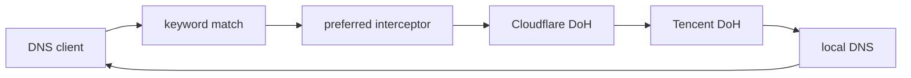

# EdgeSteer

[](https://github.com/Fuxx-1/EdgeSteer/actions/workflows/ci.yml)
[](../../LICENSE)

[English](README.md) | [中文](../../README.md)

EdgeSteer is a local Rust DNS steering proxy for macOS, Linux, and Windows. It uses JSON to describe a multi-layer upstream fallback chain and a built-in interceptor that can replace verified Cloudflare addresses with the current preferred IP.

It identifies Cloudflare from DNS response data, not from spelling. A site can be hosted on Cloudflare even when its domain and CNAME contain neither `cf` nor `cloudflare`; A, AAAA, HTTPS, and SVCB address data is checked against Cloudflare's published ranges. Mixed or unverified answers are left unchanged.

## How it works

The sample path is:



`preferred` is a response interceptor, not an independent resolver. It lets the downstream upstream return a complete DNS response, then rewrites A, AAAA, and HTTPS/SVCB hints only when the relevant addresses are all verified as Cloudflare. Rewriting clears DNSSEC `AD`, `DO`, and RRSIG state.

The built-in optimizer probes Cloudflare addresses with TCP, TLS, and HTTP. A candidate must return a 2xx response with `server: cloudflare`; the fastest IPv4 and IPv6 are selected independently. This is a reachability and latency selector, not a bandwidth benchmark.

## Quick start

Rust 1.85 or newer is required. Release archives target Linux x86_64, Intel macOS, Apple Silicon macOS, and Windows x86_64.

```sh
git clone https://github.com/Fuxx-1/EdgeSteer.git
cd EdgeSteer
cp config.example.json edgesteer.json
cargo build --locked --release
./target/release/edgesteer --config edgesteer.json --check-config
RUST_LOG=info ./target/release/edgesteer --config edgesteer.json
```

PowerShell:

```powershell
Copy-Item config.example.json edgesteer.json
cargo build --locked --release
.\target\release\edgesteer.exe --config edgesteer.json --check-config
$env:RUST_LOG = "info"
.\target\release\edgesteer.exe --config edgesteer.json
```

Use a high port for the first test:

```json
{
  "listener": { "address": "127.0.0.1:53535", "allow_remote": false }
}
```

```sh
dig @127.0.0.1 -p 53535 www.cloudflare.com A +short
```

See the [configuration guide](configuration.md) for all fields, DoH/DoT constraints, keyword matching, and plugin examples.

## Documentation

| Topic | English | 中文 |
| --- | --- | --- |
| Project overview and quick start | This page | [README](../../README.md) |
| Architecture and request lifecycle | [architecture.md](architecture.md) | [architecture.md](../zh/architecture.md) |
| JSON configuration, matching, and plugins | [configuration.md](configuration.md) | [configuration.md](../zh/configuration.md) |
| Installation, operations, reload, and troubleshooting | [operations.md](operations.md) | [operations.md](../zh/operations.md) |
| Development, tests, CI, and releases | [development.md](development.md) | [development.md](../zh/development.md) |

## Important boundaries

- The configuration is strict JSON. Unknown fields are rejected; `entry`, layer, fallback, and plugin references must exist, and fallback chains cannot contain cycles.
- `local` must be an explicit numeric resolver such as a router or SmartDNS instance. It never means the operating-system resolver, which could loop back after system DNS points to EdgeSteer.
- Only network, TLS, HTTP, empty-body, malformed-DNS, or response-correlation failures enter fallback. Valid NXDOMAIN, NODATA, SERVFAIL, and REFUSED responses are returned immediately.
- Plugins are statically compiled built-ins. JSON cannot load a dynamic library, script, or external command.
- The default listener binds only to loopback. Enabling `allow_remote: true` makes it a LAN DNS service and requires your own access control and abuse protection.

## License

MIT; see [LICENSE](../../LICENSE). EdgeSteer is independent from and not endorsed by Cloudflare.
