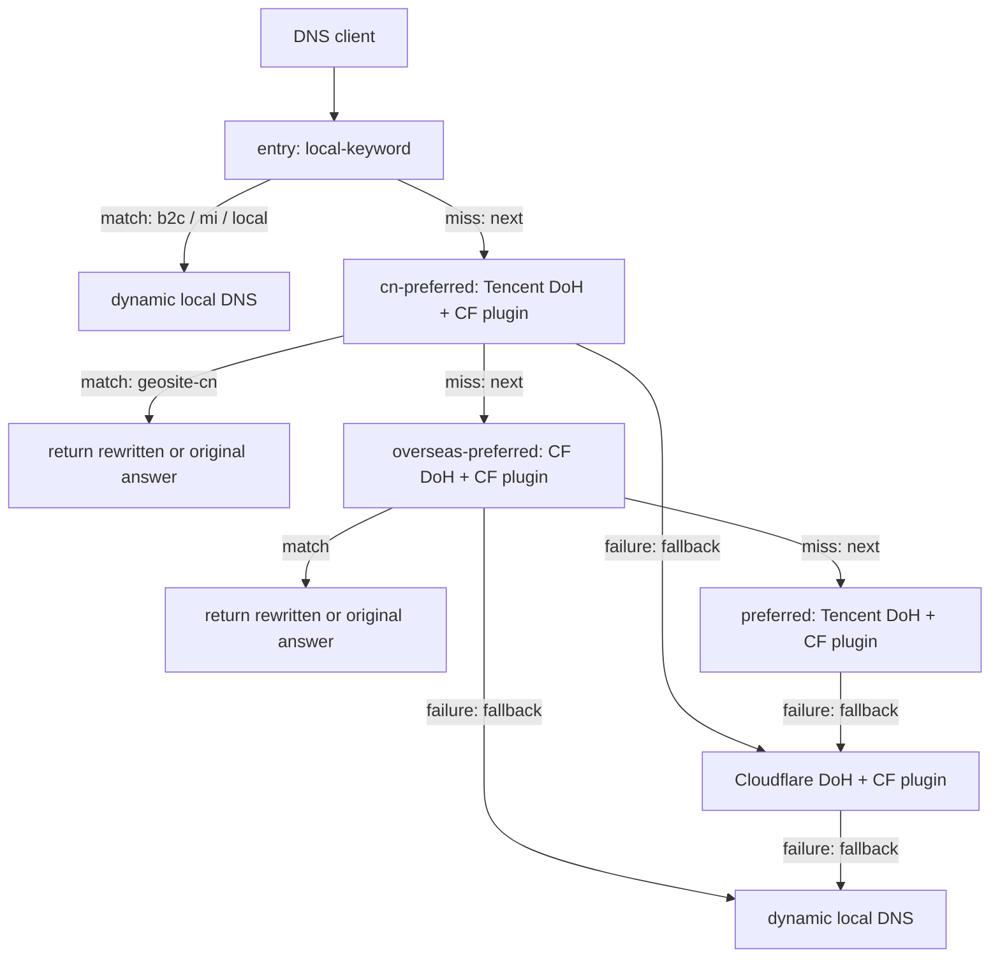

# EdgeSteer

[](https://github.com/Fuxx-1/EdgeSteer/actions/workflows/ci.yml)
[](../../LICENSE)

[English](README.md) | [中文](../../README.md)

EdgeSteer is a local Rust DNS steering proxy for macOS, Linux, and Windows. JSON defines a resolver graph that always begins at one entry: a filter miss follows `next`, a resolver transport or protocol failure follows `fallback`, and a built-in plugin can be attached to a successful resolver layer to replace verified Cloudflare addresses with the current preferred IP.

It identifies Cloudflare from DNS response data, not from spelling. A site can be hosted on Cloudflare even when its domain and CNAME contain neither `cf` nor `cloudflare`; A, AAAA, HTTPS, and SVCB address data is checked against Cloudflare's published ranges. Mixed or unverified answers are left unchanged.

## How it works

The sample evaluates one entry chain, layer by layer:



Every request begins at `entry`; the sample chain behaves as follows:

- A `local-keyword` match for `b2c`, `mi`, or `local` uses dynamic local DNS; a miss continues through `next`.
- A `cn-preferred` match uses Tencent DoH with the Cloudflare-preferred plugin; only its resolver failure falls back to Cloudflare DoH with the same plugin.
- A non-match continues to `overseas-preferred`, whose known-overseas match uses Cloudflare DoH with the plugin.
- A further non-match reaches the default Tencent DoH → Cloudflare DoH → dynamic local DNS chain. Multi-question packets skip every filtered layer and follow `next` to the default layer.

`geosite-geolocation-!cn` is not the complement of all Chinese domains: it only covers the overseas domains present in that rule set. Unknown domains therefore retain the full default fallback chain. The Cloudflare-preferred plugin runs only after its attached resolver returns a complete response, then rewrites A, AAAA, and HTTPS/SVCB hints only when the relevant addresses are all verified as Cloudflare. Rewriting clears DNSSEC `AD`, `DO`, and RRSIG state.

The built-in optimizer probes Cloudflare addresses with TCP, TLS, and HTTP. A candidate must return a 2xx response with `server: cloudflare`; the fastest IPv4 and IPv6 are selected independently. This is a reachability and latency selector, not a bandwidth benchmark.

## Quick start

Rust 1.85 or newer is required. Release assets target x86_64 and ARM64 on Linux, macOS, and Windows. macOS assets are architecture-specific `.dmg` disk images containing `EdgeSteer.app`.

```sh
git clone https://github.com/Fuxx-1/EdgeSteer.git
cd EdgeSteer
cp config.example.json "$HOME/edgesteer.json"
cargo build --locked --release
./target/release/edgesteer --check-config
RUST_LOG=info ./target/release/edgesteer
```

PowerShell:

```powershell
Copy-Item config.example.json "$env:USERPROFILE\edgesteer.json"
cargo build --locked --release
.\target\release\edgesteer.exe --check-config
$env:RUST_LOG = "info"
.\target\release\edgesteer.exe
```

Use a high port for the first test:

```json
{
  "listener": { "address": "127.0.0.1:53535", "allow_remote": false }
}
```

```sh
dig @127.0.0.1 -p 53535 www.cloudflare.com A +short
```

See the [configuration guide](configuration.md) for all fields, DoH/DoT constraints, keyword and sing-box SRS domain-rule matching, and plugin examples.

On macOS, open the matching `EdgeSteer-*-apple-darwin.dmg` and drag `EdgeSteer.app` to Applications. The App bundle manages the DNS engine. When port 53 is required, the App starts a hidden administrator-authorized helper from the same bundle, rather than installing a standalone command-line DNS service or root LaunchDaemon. The Settings page can remove a detected legacy root service after administrator authorization. The service and native UI always use `~/edgesteer.json` (`%USERPROFILE%\edgesteer.json` on Windows). The native UI opens in Chinese dark mode, uses `PingFang SC` for CJK text on macOS, and provides language and Dark/Light pick lists in Settings. The menu bar is the primary control surface for the engine, system DNS, login start, and explicit exit.

The Settings page can open the installed App at login through a user LaunchAgent. The lightweight EdgeSteer Agent owns the menu bar, resolver, system-DNS state, and login integration; the Iced settings window is a separate, disposable process connected only through a loopback control channel. When it enables system DNS, it records only the automatic-DNS physical services that EdgeSteer took over, never a DNS-address snapshot. The macOS App runs as a menu-bar agent with no Dock entry. Closing the settings window terminates its Iced/Metal renderer while the Agent and DNS engine remain available from the menu bar. Choosing `Quit EdgeSteer` explicitly restores those recorded services to automatic DHCP DNS before the Agent stops the engine and closes any settings window; a restoration failure keeps the App open. Explicit manual DNS is never overwritten. On Linux, the menu bar requires GTK 3 and an Ayatana AppIndicator runtime. An enabled optimizer requires real `compatibility_hosts`; strict mode validates both candidates and the actual query hostname with SNI/Host before issuing a rewritten address. An unverified address falls back to the original upstream answer rather than risking Error 1034.

## Documentation

| Topic | English | 中文 |
| --- | --- | --- |
| Project overview and quick start | This page | [README](../../README.md) |
| Architecture and request lifecycle | [architecture.md](architecture.md) | [architecture.md](../zh/architecture.md) |
| JSON configuration, matching, and plugins | [configuration.md](configuration.md) | [configuration.md](../zh/configuration.md) |
| Installation, operations, reload, and troubleshooting | [operations.md](operations.md) | [operations.md](../zh/operations.md) |
| Development, tests, CI, and releases | [development.md](development.md) | [development.md](../zh/development.md) |

## Important boundaries

- The configuration is strict JSON. Unknown fields are rejected; `entry`, layer, `next`, `fallback`, and plugin references must exist, and the combined `next + fallback` graph cannot contain cycles.
- `local` dynamically reads real network DNS and never calls the operating-system resolver. It filters loopback, listener, and virtual-tunnel DNS. When a macOS physical service points at the local listener, EdgeSteer reads that service's current DHCP option 6 DNS servers instead of saving or replaying old addresses.
- Native UDP/TCP queries do not bypass sing-box TUN or transparent DNS interception. Routing direct access to the underlay DNS belongs in the outer proxy configuration.
- Only network, TLS, HTTP, empty-body, malformed-DNS, or response-correlation failures enter fallback. Valid NXDOMAIN, NODATA, SERVFAIL, and REFUSED responses are returned immediately.
- Plugins are statically compiled built-ins. JSON cannot load a dynamic library, script, or external command.
- The default listener binds only to loopback. Enabling `allow_remote: true` makes it a LAN DNS service and requires your own access control and abuse protection.

## License

GPL-3.0-only; see [LICENSE](../../LICENSE). EdgeSteer is independent from and not endorsed by Cloudflare.
