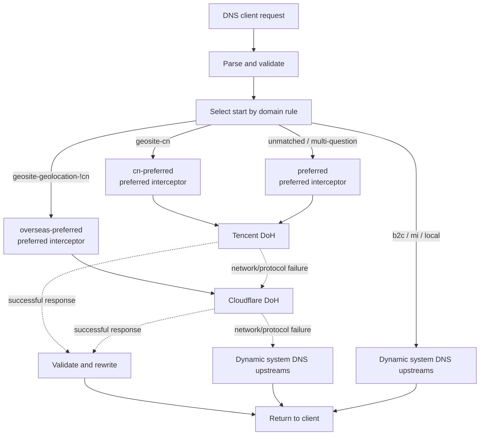

# Architecture

[English](architecture.md) | [中文](../zh/architecture.md) | [Back to English README](README.md)

EdgeSteer is not a string heuristic that replaces addresses when a domain looks like Cloudflare. It sends each DNS request through a validated resolver fallback chain, then applies a constrained response interceptor. This covers sites hosted on Cloudflare without Cloudflare-related names and avoids rewriting non-Cloudflare answers.

## System shape

Every layer is a node and its `fallback` points to the next node. The JSON describes a graph, but execution follows one validated, acyclic successor chain. Keywords and SRS domain rule sets choose the start; they do not duplicate a query across resolvers. The example order is `local-keyword`, `cn-preferred`, `overseas-preferred`, then `preferred`: local names go straight to dynamic local DNS, China uses Tencent first, known overseas domains use Cloudflare first, and unmatched domains retain the full Tencent → Cloudflare → local fallback.

## Component responsibilities

| Module | Responsibility |
| --- | --- |
| `src/dns.rs` | UDP/TCP listeners, request parsing, request deadline, layer execution, upstream correlation checks, and response encoding. |
| `src/config.rs` | Strict JSON parsing, field constraints, layer/plugin/rule-set references, acyclic fallback validation, domain matching, and DoH/DoT validation. |
| `src/local_dns.rs` | Discovers local upstreams from system network configuration, filters loopback/self addresses, refreshes periodically, and rediscovers after local failures. |
| `src/plugins.rs` | Statically built-in interceptors. `cloudflare_preferred` rewrites A, AAAA, HTTPS/SVCB hints and clears DNSSEC state. |
| `src/optimizer.rs` | TCP, TLS, and HTTP probes for Cloudflare candidates; chooses the fastest IPv4 and IPv6 independently. |
| `src/ranges.rs` | Built-in Cloudflare ranges at startup and periodic refresh from official `ips-v4` and `ips-v6` endpoints; failed refreshes keep the current list. |
| `src/rule_sets.rs` | Native domain-rule loading for sing-box SRS v1–v5, with local/remote refresh and last-good retention. |
| `src/state.rs` | `ArcSwap` runtime snapshots, rule sets, Cloudflare ranges, and the DoH client cache. |
| `src/watcher.rs` | Configuration watcher with approximately 250 ms debounce and atomic replacement after validation. |
| `src/agent.rs` | Lightweight resident Agent for the menu bar, DNS-engine lifecycle, system DNS, login integration, and loopback control channel. It does not load Iced or a GPU renderer. |
| `src/ui.rs` | Separate Iced settings window. Closing it exits that process and releases GPU/Metal resources while the Agent and DNS engine continue in the menu bar. |

## Request lifecycle

1. The listener receives a UDP datagram or TCP length-prefixed frame. UDP work is limited to 128 in-flight permits; excess bursts are dropped so clients can retry.
2. Only DNS queries are accepted. Malformed packets, DNS responses received on the listener, and unparseable requests are discarded.
3. The request reads one `RuntimeConfig` snapshot, current Cloudflare ranges, and loaded rule sets. A single-question request provides its QNAME; a multi-question request uses `entry` directly.
4. For one question, the first matching keyword or SRS rule set in `layers` declaration order selects the start. Without a match, execution starts at `entry`. A selected layer follows only its own `fallback` chain.
5. Network layers use both a global request deadline and a per-layer timeout. `local` selects cached system-DNS addresses in order. A truncated UDP response is retried over TCP against the same endpoint.
6. An upstream response must match transaction ID, QR/message type, opcode, and question. DoH also requires a successful HTTP status, a non-empty body, and `application/dns-message`.
7. After a network layer succeeds, interceptors run in reverse entry order. `cloudflare_preferred` rewrites only when all relevant addresses are in the active Cloudflare ranges; no rewrite is a successful no-op.
8. If every network layer fails, EdgeSteer creates a `SERVFAIL` response containing the original questions rather than forwarding malformed or mismatched bytes.

## Fallback and response semantics

Fallback means that the current layer could not provide an acceptable DNS wire response: connection timeout, TLS or HTTP failure, wrong Content-Type, empty body, malformed DNS, or failed correlation checks. A valid DNS response ends the chain, including `NXDOMAIN`, NODATA, `SERVFAIL`, and `REFUSED`. This avoids changing valid answers because providers disagree and avoids sending the same query to more providers.

An interceptor does not synthesize a complete DNS answer. It can only change allowed records after a downstream resolver returns a valid response. Rewriting clears `AD`, EDNS `DO`, and RRSIG records so modified data is not presented as DNSSEC-authenticated.

## Cloudflare detection and optimization

Detection uses numeric addresses in the response and IP hints in HTTPS/SVCB records. They must belong to the active Cloudflare ranges. The ranges start from a built-in list and are refreshed from the official lists; a failed refresh never clears the active list.

The optimizer samples configured IP/CIDR candidates, filters `excluded_candidates`, and then intersects them with the active official Cloudflare ranges. Every candidate runs `probes_per_candidate` consecutive TCP, TLS, and HTTP probes using `test_host` and `test_path`; any failed attempt rejects the candidate. Successful candidates are ranked by median latency plus half of their tail latency, favoring low-latency, stable edges over a one-off fast but jittery response. The response must be 2xx with `server: cloudflare`.

An enabled optimizer requires at least one `compatibility_hosts` entry. A candidate must also pass repeated SNI/Host requests for every business host, returning 2xx/3xx with no 1034/EIV refusal marker before it can be selected. This strict mode ignores static preferred addresses and clears an old result after an empty or failed round. Every DNS hostname that would be rewritten receives the same short-lived SNI/Host verification; pending, failed, or expired validation returns the upstream answer. A preferred address therefore cannot cross into an unverified Cloudflare zone, and the cache lifetime is no longer than the rewritten DNS TTL.

## Reload and consistency

The watcher fully parses and validates new JSON before replacing the runtime snapshot. In-flight requests keep their old snapshot and later requests see the new one, so configuration and optimizer state cannot be mixed across generations. The rule-set worker immediately reconciles new definitions and atomically publishes a completed replacement. Layer changes clear cached DoH clients; when a `local` layer exists, its refresh loop rereads system DNS at the new shortest `refresh_secs` interval.

Listener address and `allow_remote` changes cannot rebind sockets dynamically. The file can be accepted, but the process keeps the existing listener and logs that a restart is required; other valid settings still reload.

## App lifecycle

The packaged App starts the EdgeSteer Agent first. The Agent uses a native event loop and a menu-bar icon while it owns the DNS runtime; the Iced settings window runs as a separate child process only at first launch or when opened from the menu bar. Its control channel binds only `127.0.0.1` and requires the random token stored in the Agent state record, so the UI never owns the resolver directly.

Closing Settings normally exits the UI process instead of hiding its wgpu/Metal renderer. DNS, the menu bar, and any managed system DNS remain available while the complete GUI allocation is released. Opening Settings from the menu bar creates a fresh UI process. When the user explicitly chooses `Quit EdgeSteer`, the Agent restores the system DNS it owns first, stops the resolver, then closes any remaining settings window.

## Security boundaries

- JSON selects only statically compiled built-in plugins; it cannot load libraries, scripts, or shell commands.
- For DoH, `address` is a fixed numeric bootstrap. The URL hostname supplies TLS SNI, HTTP Host, and certificate validation; proxy environment settings are disabled and redirects are not followed.
- DoT requires an explicit `server_name` and validates TLS with the bundled WebPKI roots.
- `local` does not call the system resolver. It reads numeric DNS addresses from system network configuration and filters loopback, unspecified, multicast, IPv6 link-local, listener addresses, and macOS virtual-tunnel services. When a macOS physical service only points at the local listener, it reads that service's current DHCP option 6 DNS instead of looping or pinning an overwritten underlay address.
- Local queries use native UDP/TCP sockets, which does not mean bypassing sing-box TUN or transparent interception; outer proxy rules must route the underlay DNS correctly.
- The default listener binds to loopback. If `allow_remote` is enabled, provide network access control, rate limiting, and monitoring.
