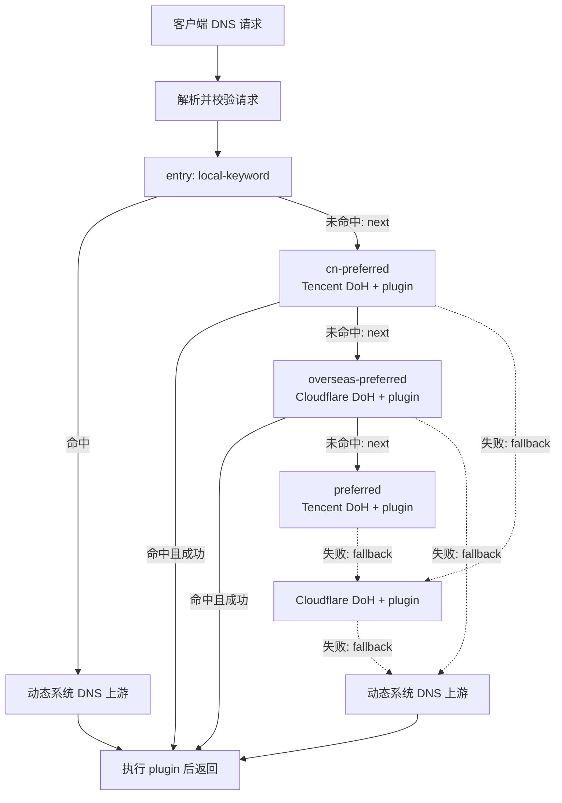

# 架构

[中文](architecture.md) | [English](../en/architecture.md) | [返回中文首页](../../README.md)

EdgeSteer 的核心不是“看到域名像 Cloudflare 就替换 IP”，而是把每个 DNS 请求送入一张从统一入口开始、可验证的 resolver 图，再对成功 resolver 绑定的响应插件执行受约束处理。这样可以处理域名、CNAME 和 Cloudflare 没有文字关系的站点，也不会误改非 Cloudflare 地址。

## 总体结构

每个 layer 都是 resolver 节点。`entry` 是唯一入口，`next` 只在过滤未命中时使用，`fallback` 只在本 resolver 的网络或协议失败时使用。配置看起来像图，但运行时只允许沿一条经过校验的无环路径前进；关键词和 SRS 域名规则集不会选择全局起点，也不会把请求复制给多个 resolver。示例中本地域名直接使用动态 local，国内先用 Tencent，已收录海外先用 CF，未分类则进入 Tencent → CF → local 默认路径。

## 组件职责

| 模块 | 职责 |
| --- | --- |
| `src/dns.rs` | UDP/TCP listener、DNS 请求解析、单请求 deadline、layer 执行、上游响应关联校验和最终编码。 |
| `src/config.rs` | 严格 JSON 反序列化、字段约束、layer/plugin/规则集引用、`next + fallback` 图无环校验、域名匹配和 DoH/DoT 校验。 |
| `src/local_dns.rs` | 从系统网络配置发现 local 上游、过滤回环/自身地址、按周期刷新并在 local 失败时重新发现。 |
| `src/plugins.rs` | 静态 builtin 响应插件。当前实现 `cloudflare_preferred`，负责 A、AAAA、HTTPS/SVCB hints 改写和 DNSSEC 状态清理。 |
| `src/optimizer.rs` | 对 Cloudflare 候选地址做多次 TCP、TLS、HTTP 探测，独立选出稳定的 IPv4/IPv6。 |
| `src/ranges.rs` | 启动时使用内置 Cloudflare 网段，并定期从官方 `ips-v4`、`ips-v6` 地址刷新；失败保留旧列表。 |
| `src/rule_sets.rs` | 原生加载 sing-box SRS v1–v5 的域名规则；本地/远程来源定时刷新，失败保留上一份可用规则。 |
| `src/state.rs` | 用 `ArcSwap` 保存运行时快照、规则集和 Cloudflare 网段，并缓存 DoH client。 |
| `src/watcher.rs` | 监听配置文件，约 250 ms debounce，校验成功后原子替换；非法文件继续使用旧配置。 |
| `src/agent.rs` | 轻量常驻 Agent：菜单栏、DNS 引擎生命周期、系统 DNS、登录启动与本机控制通道。它不加载 Iced 或 GPU renderer。 |
| `src/ui.rs` | 独立的 Iced 配置窗口。关闭窗口即退出该进程并释放 GPU/Metal；Agent 和 DNS 引擎继续在菜单栏运行。 |

## 一次请求的生命周期

1. listener 接收 UDP 数据报或 TCP 长度帧。UDP 请求受 128 个并发 permit 限制，超过上限的突发请求会被丢弃并等待客户端重试。
2. 只接受 DNS query。畸形数据、收到的 DNS response 或无法解析的请求不会转发。
3. 请求读取一个 `RuntimeConfig` 快照、当前 Cloudflare 网段和已加载的规则集。每个请求都从 `entry` 开始；单 question 请求提取 QNAME，多 question 请求没有唯一域名。
4. 空 `match` 的 layer 直接适用；带过滤的 layer 只在单 question 的关键词或 SRS 规则集命中时适用。未命中不查询该 resolver，直接沿 `next` 继续；多 question 以同样方式跳过所有带过滤的层。
5. 对网络 layer 施加全局 request deadline 与单层 timeout。`local` 从缓存的系统 DNS 地址中依次选取上游；UDP 收到 `TC=1` 时，会对同一个 endpoint 重试 TCP。
6. 上游响应必须满足 transaction ID、QR/message type、opcode 和 question 与请求一致。DoH 还必须是成功 HTTP 状态、非空 body 和 `application/dns-message`。
7. resolver 成功后，执行其可选响应插件。`cloudflare_preferred` 只有在目标地址全部属于当前 Cloudflare 网段时才改写；无可改写项是成功的 no-op。
8. 如果所有适用的 resolver 都失败，生成带原 question 的 `SERVFAIL`，而不是把畸形或错配数据返回给客户端。

## Next、回退与响应语义

`next` 表示当前层的过滤条件未命中，因此该 resolver 完全不会被查询。回退只表示当前 resolver 无法提供可接受的 DNS wire response，典型原因包括连接超时、TLS 失败、HTTP 失败、错误 Content-Type、空 body、畸形 DNS 或响应关联字段不匹配。有效 DNS response 会立即结束链路，包括 `NXDOMAIN`、NODATA、`SERVFAIL` 和 `REFUSED`；这样不会因为不同 resolver 的策略而改变有效结果，也避免额外泄露查询。

响应插件不会自行伪造完整 DNS answer。它只能在自身绑定的 resolver 返回成功响应后修改允许的记录；改写后清除 `AD`、EDNS `DO` 和 RRSIG，防止修改后的内容继续声称通过 DNSSEC 验证。

## Cloudflare 识别与优选

识别依据是响应中的数值地址和 HTTPS/SVCB 的 IP hints 是否落在活动网段。活动网段来自内置列表，并由官方列表定期刷新。刷新失败时不清空当前列表。

optimizer 从配置的 IP/CIDR 候选中采样，并先过滤 `excluded_candidates`，再与 Cloudflare 官方活动网段求交。每个候选会连续探测 `probes_per_candidate` 次；任何一次 TCP 连接、TLS 握手或以 `test_host`、`test_path` 发起的 HTTP 探测失败都会淘汰该候选。成功候选按中位延迟加一半尾延迟排序，因此低延迟且稳定的地址优先于偶发快但抖动大的地址。响应必须为 2xx 且具有 `server: cloudflare`。

启用 optimizer 要求配置至少一个 `compatibility_hosts`。候选还必须以每个业务域名的 SNI 和 Host 连续验证，返回 2xx/3xx 且没有 1034/EIV 拒绝标识才能被选择。此严格模式忽略静态优选值；空选项或失败轮次会清空旧结果。每个真正被 DNS 查询的域名还要经过一次同样的短时 SNI/Host 验证，验证中、失败或过期时直接返回上游答案。这样优选地址不会跨越未验证的 Cloudflare zone；验证缓存最长等于改写 TTL。

## 热重载与一致性

watcher 先读取并完整校验新 JSON，再替换运行时快照。正在处理的请求继续使用旧快照，后续请求读取新快照；因此不会出现配置字段来自两代、优选状态来自另一代的组合。规则集 worker 会立即按新定义刷新，并在成功后原子替换整份规则；layer 变化会清理 DoH client 缓存；若存在 `local` layer，刷新循环会按新的最短 `refresh_secs` 重新读取系统 DNS。

listener 地址和 `allow_remote` 变化不能动态重绑。文件可以被接受，但当前进程继续监听旧 socket，并记录需要重启；其他有效配置仍可热更新。

## App 生命周期

打包 App 启动后先运行 EdgeSteer Agent。Agent 使用原生事件循环和菜单栏图标，持有 DNS runtime；Iced 配置窗口只在首次启动或从菜单栏打开设置时作为单独子进程运行。控制通道只监听 `127.0.0.1`，并要求状态文件中的随机令牌，因此 UI 不直接持有 DNS runtime。

默认关闭设置窗口会结束 UI 子进程，而不是把窗口和 wgpu/Metal renderer 隐藏在后台。这样 DNS、菜单栏和系统 DNS 接管保持可用，但完整 GUI 资源会立即释放。菜单栏再次打开设置时会创建一个新的 UI 进程。明确选择“退出 EdgeSteer”时，Agent 先恢复它接管的系统 DNS，再停止 resolver，最后关闭仍在运行的设置窗口。

## 安全边界

- JSON 只能选择静态编译的 builtin plugin，不会加载动态库、脚本或 shell 命令。
- DoH 的 `address` 是固定数值 bootstrap，URL 主机名用于 TLS SNI、HTTP Host 和证书校验；客户端禁用代理环境变量并不跟随重定向。
- DoT 必须显式提供 `server_name`，使用项目内置的 WebPKI 根证书校验 TLS。
- `local` 不调用系统 resolver，而是从系统网络配置读取数值 DNS 地址。它过滤回环、未指定、组播、IPv6 link-local、listener 地址以及 macOS 的虚拟隧道服务；macOS 物理服务仅剩本机 listener 时，读取同一服务 DHCP Option 6 中当前下发的 DNS，因此不会回环或固化旧地址。
- local 查询使用原生 UDP/TCP socket，但这不等同于绕过 sing-box TUN 或透明接管；下层 DNS 的路由必须由外层代理规则保证。
- 默认 listener 只绑定回环地址。开放 `allow_remote` 前应在网络边界提供访问控制、限速和监控。
