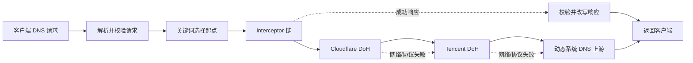

# 架构

[中文](architecture.md) | [English](../en/architecture.md) | [返回中文首页](../../README.md)

EdgeSteer 的核心不是“看到域名像 Cloudflare 就替换 IP”，而是把 DNS 请求送入一条可验证的 resolver 回退链，再对最终响应执行受约束的响应拦截。这样可以处理域名、CNAME 和 Cloudflare 没有文字关系的站点，也不会误改非 Cloudflare 地址。

## 总体结构

每个 layer 都是图中的一个节点，`fallback` 指向下一个节点。配置看起来像图，但运行时只允许沿一条无环的后继链前进；关键词规则选择链的起点，不会把请求复制给多个 resolver。

## 组件职责

| 模块 | 职责 |
| --- | --- |
| `src/dns.rs` | UDP/TCP listener、DNS 请求解析、单请求 deadline、layer 执行、上游响应关联校验和最终编码。 |
| `src/config.rs` | 严格 JSON 反序列化、字段约束、layer/plugin 引用、fallback 无环校验、关键词匹配和 DoH/DoT 校验。 |
| `src/local_dns.rs` | 从系统网络配置发现 local 上游、过滤回环/自身地址、按周期刷新并在 local 失败时重新发现。 |
| `src/plugins.rs` | 静态 builtin interceptor。当前实现 `cloudflare_preferred`，负责 A、AAAA、HTTPS/SVCB hints 改写和 DNSSEC 状态清理。 |
| `src/optimizer.rs` | 对 Cloudflare 候选地址做 TCP、TLS、HTTP 探测，独立选出最快 IPv4/IPv6。 |
| `src/ranges.rs` | 启动时使用内置 Cloudflare 网段，并定期从官方 `ips-v4`、`ips-v6` 地址刷新；失败保留旧列表。 |
| `src/state.rs` | 用 `ArcSwap` 保存运行时快照，缓存 DoH client，保证配置、插件和优选状态按同一代读取。 |
| `src/watcher.rs` | 监听配置文件，约 250 ms debounce，校验成功后原子替换；非法文件继续使用旧配置。 |

## 一次请求的生命周期

1. listener 接收 UDP 数据报或 TCP 长度帧。UDP 请求受 128 个并发 permit 限制，超过上限的突发请求会被丢弃并等待客户端重试。
2. 只接受 DNS query。畸形数据、收到的 DNS response 或无法解析的请求不会转发。
3. 请求读取一个 `RuntimeConfig` 快照和当前 Cloudflare 网段。单 question 请求提取 QNAME；多 question 请求直接使用 `entry`。
4. 对单 question 按 `layers` 的声明顺序寻找第一个匹配的 `match`，无命中则从 `entry` 开始。命中 layer 后只沿该 layer 的 `fallback` 链继续。
5. 对网络 layer 施加全局 request deadline 与单层 timeout。`local` 从缓存的系统 DNS 地址中依次选取上游；UDP 收到 `TC=1` 时，会对同一个 endpoint 重试 TCP。
6. 上游响应必须满足 transaction ID、QR/message type、opcode 和 question 与请求一致。DoH 还必须是成功 HTTP 状态、非空 body 和 `application/dns-message`。
7. 网络层成功后，按进入顺序的反向执行 interceptor。`cloudflare_preferred` 只有在目标地址全部属于当前 Cloudflare 网段时才改写；无可改写项是成功的 no-op。
8. 如果所有网络层都失败，生成带原 question 的 `SERVFAIL`，而不是把畸形或错配数据返回给客户端。

## 回退与响应语义

回退只表示当前层无法提供可接受的 DNS wire response，典型原因包括连接超时、TLS 失败、HTTP 失败、错误 Content-Type、空 body、畸形 DNS 或响应关联字段不匹配。有效 DNS response 会立即结束链路，包括 `NXDOMAIN`、NODATA、`SERVFAIL` 和 `REFUSED`；这样不会因为不同 resolver 的策略而改变有效结果，也避免额外泄露查询。

interceptor 不会自行伪造完整 DNS answer。它只能在后继 resolver 返回成功响应后修改允许的记录；改写后清除 `AD`、EDNS `DO` 和 RRSIG，防止修改后的内容继续声称通过 DNSSEC 验证。

## Cloudflare 识别与优选

识别依据是响应中的数值地址和 HTTPS/SVCB 的 IP hints 是否落在活动网段。活动网段来自内置列表，并由官方列表定期刷新。刷新失败时不清空当前列表。

optimizer 从配置的 IP/CIDR 候选中采样，只接受 TCP 连接、TLS 握手和 HTTP 探测都成功的地址；测试请求使用 `test_host` 和 `test_path`，要求 2xx 与 `server: cloudflare`。IPv4 和 IPv6 分开比较时延，某一族探测失败不会覆盖另一族或已有的最后成功值。

## 热重载与一致性

watcher 先读取并完整校验新 JSON，再替换运行时快照。正在处理的请求继续使用旧快照，后续请求读取新快照；因此不会出现配置字段来自两代、优选状态来自另一代的组合。layer 变化会清理 DoH client 缓存；若存在 `local` layer，刷新循环会按新的最短 `refresh_secs` 重新读取系统 DNS。

listener 地址和 `allow_remote` 变化不能动态重绑。文件可以被接受，但当前进程继续监听旧 socket，并记录需要重启；其他有效配置仍可热更新。

## 安全边界

- JSON 只能选择静态编译的 builtin plugin，不会加载动态库、脚本或 shell 命令。
- DoH 的 `address` 是固定数值 bootstrap，URL 主机名用于 TLS SNI、HTTP Host 和证书校验；客户端禁用代理环境变量并不跟随重定向。
- DoT 必须显式提供 `server_name`，使用项目内置的 WebPKI 根证书校验 TLS。
- `local` 不调用系统 resolver，而是从系统网络配置读取数值 DNS 地址。它过滤回环、未指定、组播、IPv6 link-local、listener 地址以及 macOS 的虚拟隧道服务；若系统配置已指向 EdgeSteer，会失败而不是回环，也无法还原被覆盖的下层 DNS。
- local 查询使用原生 UDP/TCP socket，但这不等同于绕过 sing-box TUN 或透明接管；下层 DNS 的路由必须由外层代理规则保证。
- 默认 listener 只绑定回环地址。开放 `allow_remote` 前应在网络边界提供访问控制、限速和监控。
